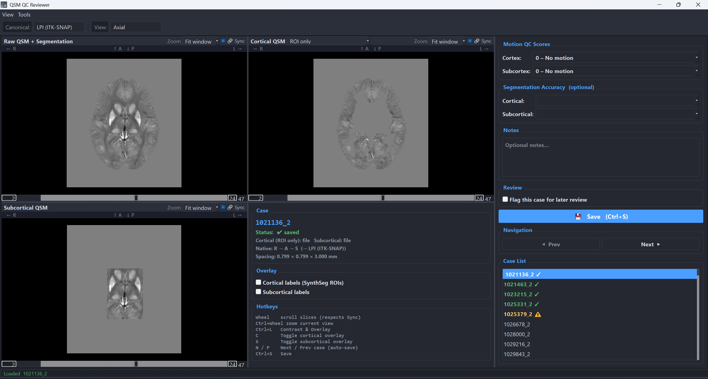
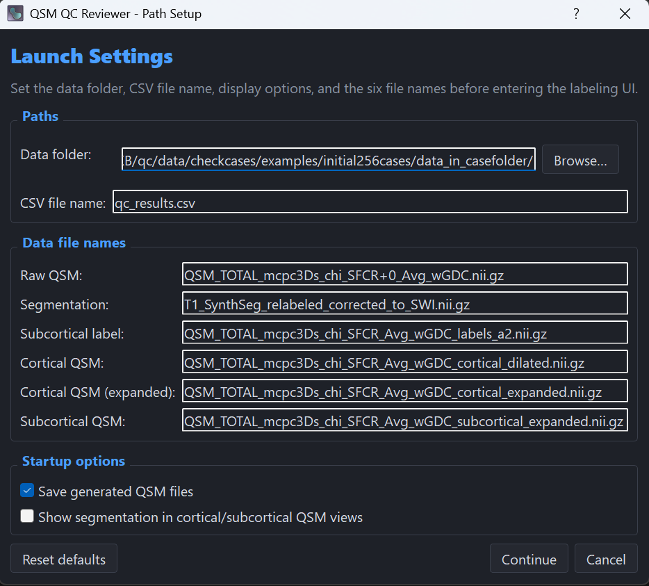

# QSM QC Reviewer

A desktop application for **scan-level quality control (QC)** of **Quantitative Susceptibility Mapping (QSM)** data.

QSM QC Reviewer is designed for efficient visual inspection of raw and derived QSM images in a unified interface. It supports multi-view review, structured QC scoring, segmentation overlays, case flagging, CSV-based annotation persistence, and interactive navigation optimized for high-throughput review workflows.

---

## Table of Contents

- [Overview](#overview)
- [Screenshots](#screenshots)
- [Key Features](#key-features)
- [Expected Input Files](#expected-input-files)
- [Output](#output)
- [Typical Workflow](#typical-workflow)
- [Installation](#installation)
- [Performance Notes](#performance-notes)
- [Use Cases](#use-cases)
- [Project Structure](#project-structure)
- [License](#license)
- [Acknowledgments](#acknowledgments)

---

## Overview

This application is intended for workflows where reviewers need to:

- inspect **raw QSM**, **cortical QSM**, and **subcortical QSM** side by side,
- navigate slices quickly and smoothly,
- evaluate motion-related image quality,
- assess segmentation quality,
- add notes and review flags,
- and save case-level annotations in a structured CSV format.

The app also supports automatic generation and optional saving of derived QSM images used during review.

---

## Screenshots

### Main reviewer interface


### Path setup window

---

## Key Features

### Multi-view QSM review
The reviewer interface provides coordinated image panels for:

- **Raw QSM**
- **Cortical QSM**
- **Subcortical QSM**

The layout is resizable, allowing reviewers to adjust panel sizes during review.

### Startup path setup
When the application opens, it first presents a **Path Setup** window where you can configure:

- the root data folder,
- the CSV file name,
- required input file names,
- whether generated QSM files should be saved,
- and whether segmentation overlays should also appear in derived cortical/subcortical QSM views.

This makes the application flexible across datasets and directory structures without requiring code changes.

### Structured QC scoring
The QC panel supports structured case-level review fields, including:

- **Motion QC**
  - Cortex
  - Subcortex

- **Segmentation Accuracy**
  - Cortical
  - Subcortical

- **Notes**
  - Free-text observations

All annotations can be saved and restored automatically from CSV.

### Case list status tracking
The case list visually indicates review progress:

- completed cases can be marked with a check,
- flagged cases display a warning marker,
- previously saved annotations are restored when the app is reopened.

### Missing-score warning
If a reviewer tries to move to another case while a required **Motion QC** field is empty, the app:

- shows a warning dialog,
- highlights the missing field in red,
- and allows the reviewer to either continue or cancel.

If the reviewer cancels and fills in the missing score, the highlight is cleared automatically.

### Review flagging
Cases can be marked for later review using a dedicated flag option.

Flagged cases are:
- visually marked in the case list,
- saved in the CSV output,
- and can be unflagged at any time.

### Segmentation overlays
The app supports segmentation and label overlays for review.

Depending on the selected settings, overlays can be shown not only on the raw QSM view but also on:

- **Cortical QSM**
- **Subcortical QSM**

This helps reviewers directly compare derived QSM images with their corresponding segmentation context.

### Cortical QSM display modes
The cortical panel supports multiple display modes:

- **ROI only**
- **Expanded**

The **Expanded** mode combines:
- the ROI-based cortical mask, and
- the region outside the subcortical cube mask,

so reviewers can visualize both cortical ROI content and non-subcortical outer regions.

By default, the cortical panel displays the **Expanded** version.

### Interactive zoom controls
Each image panel includes an independent **Zoom** control with:

- Fit window
- 25%
- 50%
- 75%
- 100%
- 125%
- 150%
- 200%
- 300%
- custom input values

Custom examples:
- `180%`
- `180`
- `1.8`

### Fast slice navigation
The interface supports efficient navigation:

- **Mouse wheel** for slice scrolling
- **Ctrl + mouse wheel** for zoom changes in the active panel only

The viewer behavior is optimized for smoother scrolling and responsive case switching during long review sessions.

### CSV-based annotation persistence
If the configured CSV file already contains saved annotations, the app restores them automatically when matching cases are loaded, including:

- Motion QC scores
- Segmentation Accuracy scores
- Notes
- Review flags

---

## Expected Input Files

The application expects case folders containing NIfTI files used for raw and derived QSM review.

Default file definitions:

```python
FILE_NAMES = {
    "raw_qsm":           "QSM_TOTAL_mcpc3Ds_chi_SFCR+0_Avg_wGDC.nii.gz",
    "segmentation":      "T1_SynthSeg_relabeled_corrected_to_SWI.nii.gz",
    "subcortical_label": "QSM_TOTAL_mcpc3Ds_chi_SFCR_Avg_wGDC_labels_a2.nii.gz",
    "cortical_qsm":      "QSM_TOTAL_mcpc3Ds_chi_SFCR_Avg_wGDC_cortical_dilated.nii.gz",
    "cortical_qsm_cube": "QSM_TOTAL_mcpc3Ds_chi_SFCR_Avg_wGDC_cortical_expanded.nii.gz",
    "subcortical_qsm":   "QSM_TOTAL_mcpc3Ds_chi_SFCR_Avg_wGDC_subcortical_expanded.nii.gz",
}
```

These names can be customized from the **Path Setup** window before entering the main reviewer interface.

---

## Output

The application saves review annotations to a CSV file, including case-level fields such as:

- case ID
- cortical motion QC
- subcortical motion QC
- cortical segmentation accuracy
- subcortical segmentation accuracy
- notes
- review flag

If the CSV already exists, previously saved annotations are reloaded automatically.

---

## Typical Workflow

1. Launch the application.
2. Configure the dataset path and file settings in the **Path Setup** window.
3. Enter the main reviewer interface.
4. Review the raw, cortical, and subcortical QSM panels.
5. Adjust zoom, overlays, and panel sizes as needed.
6. Assign QC scores.
7. Add notes if necessary.
8. Flag cases for later review when appropriate.
9. Save the review.
10. Move to the next case or jump to a specific case from the case list.

---

## Installation

### Option 1: Download the packaged application
Prebuilt Windows versions can be downloaded from the repository’s **Releases** page.

After downloading:

1. Extract the zip package.
2. Open the extracted folder.
3. Run the application executable.

### Option 2: Run from source
A Python environment with the required dependencies is needed.

Typical dependencies include:

- Python 3.10
- PyQt5
- napari
- numpy
- scipy
- nibabel
- pandas

Install dependencies, then launch the application from the project directory.

```bash
python QCreviewer.py
```

Replace `QCreviewer.py` with the actual entry script name if needed.

---

## Performance Notes

The application includes several optimizations for large-scale review sessions, such as:

- background case loading,
- recent-case caching,
- smoother wheel-based slice navigation,
- reduced unnecessary redraws,
- and improved responsiveness when switching between cases.

Actual performance may still depend on:

- image size,
- storage speed,
- system memory,
- graphics environment,
- and the total number of cases being reviewed.

---

## Use Cases

QSM QC Reviewer is particularly useful for:

- large cohort QSM studies,
- scan-level QC workflows,
- reviewer-driven QC pipelines,
- generation and inspection of cortical/subcortical derived QSM views,
- and projects requiring structured annotation export.

---

## Project Structure

Example repository structure:

```text
QCreviewer/
├─ QCreviewer.py
├─ README.md
├─ app.ico
└─ other project files
```

---

## License

Add your license information here.

For example:

```text
MIT License 
```

Or replace this section with the license used by your project.

---

## Acknowledgments

This project uses common scientific Python and desktop visualization tools in the QSM review workflow, including components from the Python scientific computing ecosystem and Qt-based desktop UI frameworks.
